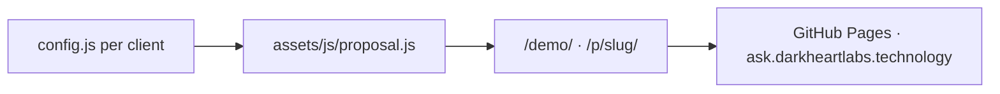

# Ask — Custom Date Proposals

Static interactive date proposal mini-sites hosted at [ask.darkheartlabs.technology](https://ask.darkheartlabs.technology).

**Tech spec:** [docs/TECH_SPEC.md](docs/TECH_SPEC.md)

## Problem

The viral "Replit date proposal" trend works because it's personal, funny, and interactive — but most people won't build one themselves.

## Solution

Dark Heart Labs hand-builds custom proposal pages: runaway No button, day/time/food wizard, DHL theme, private slug on `ask.darkheartlabs.technology`.

## Architecture



## Tech stack

- Static HTML, CSS, vanilla JavaScript
- GitHub Pages (no build step)
- Signal Protocol theme tokens from Dark Heart Labs

## Setup

```bash
git clone https://github.com/jv-darkheartlabs/ask.git
cd ask
# Serve locally (optional):
python3 -m http.server 8080
# Open http://localhost:8080/demo/
```

## Client delivery

See [docs/BUILD_GUIDE.md](docs/BUILD_GUIDE.md). Copy `_template/` to `p/{slug}/`, edit `config.js`, push to `main`.

## URLs

| Path | Purpose |
|------|---------|
| `/` | Service landing |
| `/demo/` | Interactive demo with theme toggle |
| `/p/{slug}/` | Client proposal (private) |

## Testing

- Manual: open `/demo/` — verify all 5 steps, No button dodge, theme toggle, confetti on food vote
- Mobile: test on phone-width viewport
- Reduced motion: enable in OS settings — animations should calm down

## Evidence map

| Concern | Path |
|---------|------|
| Wizard engine | `assets/js/proposal.js` |
| DHL theme | `assets/css/theme-dhl.css` |
| Client template | `_template/` |
| Deploy + DNS | `docs/DEPLOY.md` |

---

**Maintained by:** [Dark Heart Labs](https://darkheartlabs.technology)  
**Author:** Jennifer ([@jv-darkheartlabs](https://github.com/jv-darkheartlabs))  
**Site:** https://darkheartlabs.technology
