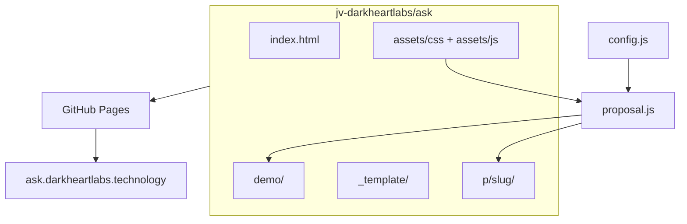

# Technical Specification — Ask (Date Proposals)

## Overview

Static multi-step date proposal mini-sites at `ask.darkheartlabs.technology`, sold as a Dark Heart Labs micro-service.

## Problem statement

People want viral-style interactive date proposals but lack time or skills to build them. Existing trend examples are one-offs with no polish, privacy, or brand consistency.

## Solution summary

A config-driven static app: one shared JS engine, per-client `config.js`, DHL theme, deployed as folder-per-client on GitHub Pages.

## Architecture

### Components

| Component | Responsibility |
|-----------|----------------|
| `proposal.js` | Wizard steps, runaway No, chip/food UI, theme toggle, confetti |
| `config.js` | Per-client names, options, theme, punchline, noindex |
| `theme-dhl.css` | Signal Protocol tokens |
| `_template/` | Copy source for manual client builds |

## Tech stack

| Layer | Technology |
|-------|------------|
| UI | HTML5, CSS custom properties, vanilla JS |
| Hosting | GitHub Pages |
| DNS | CNAME `ask` → `jv-darkheartlabs.github.io` |
| Fonts | Google Fonts (Fira Code, Fira Sans, Cormorant Garamond) |

## Interfaces

### Entry points

- `GET /` — service landing
- `GET /demo/` — public demo
- `GET /p/{slug}/` — client proposal (unlisted; noindex; not authenticated)

### Configuration

- `window.PROPOSAL_CONFIG` in each folder's `config.js`

## Data and persistence

- None. All static; selections live in memory for the session only.

## Deployment

- **Target:** GitHub Pages, custom domain `ask.darkheartlabs.technology`
- **Build:** None — deploy root as static files
- **Run:** Push to `main`; GitHub Actions uploads artifact
- **Health:** `GET /` returns 200

See [DEPLOY.md](DEPLOY.md) for DNS and Pages settings.

## Testing strategy

| Layer | Command | Coverage |
|-------|---------|----------|
| Manual | Open `/demo/` in browser | Full wizard flow |
| Manual | Mobile viewport | Touch No dodge |

## Security and reliability notes

- Client pages default to `noindex` via static meta plus config
- `robots.txt` disallows `/p/`
- Unguessable slugs recommended; URLs are unlisted, not private. This repo is public — do not commit real names or inboxes
- No PII stored server-side. Send uses Formspree/Web3Forms POST (`docs/MAIL.md`). mailto is not used: iCloud MX junks visitor-originated Gmail/iCloud mail

## Evidence map

| Concern | Path |
|---------|------|
| Wizard | `assets/js/proposal.js` |
| Form POST | `assets/js/form-submit.js`, `test/form-submit.test.js` |
| Mail | `docs/MAIL.md`, `docs/adr/0003-server-side-form-delivery.md` |
| Themes | `assets/css/theme-dhl.css` |
| Build SOP | `docs/BUILD_GUIDE.md` |
| DNS | `docs/DEPLOY.md`, `CNAME` |

## Architecture decisions

Record significant decisions in `docs/adr/`. Start with `docs/adr/0001-record-architecture-decisions.md`.

---

**Maintained by:** [Dark Heart Labs](https://darkheartlabs.technology)  
**Author:** Jennifer ([@jv-darkheartlabs](https://github.com/jv-darkheartlabs))  
**Site:** https://darkheartlabs.technology
